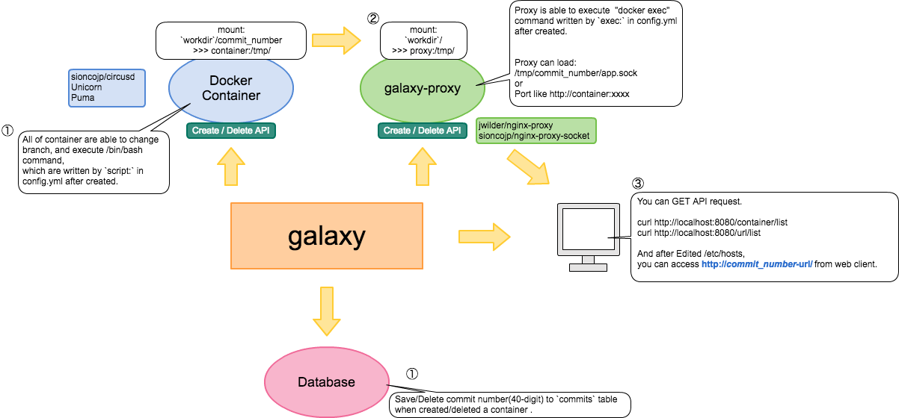

# Galaxy
* Galaxy provides you with target repository's http server as URL: `http://{{commit-number}}-{{url}}` by running container.


## Usage
* You need to install docker from https://www.docker.com/

```shell
### create database writing in config.yml
> create database galaxy
> create table commits(
id bigint(20) unsigned NOT NULL PRIMARY KEY AUTO_INCREMENT,
number char(40) UNIQUE NOT NULL,
created_at DATETIME NOT NULL DEFAULT CURRENT_TIMESTAMP,
INDEX idx_number(number)
);

### run app
$ go get -u github.com/sioncojp/galaxy
$ make deps
$ make build
$ bin/galaxy -c config.yml
```

#### examples
* Sample of Go http server is [doc/sample_go/README.md](doc/sample_go/README.md)
* Sample of Rails http server is [doc/sample_rails/README.md](doc/sample_rails/README.md)

## config.yml
* You can execute external /bin/bash script after the repository will have changed a commit number.

## API
### create target repository
```shell
curl http://localhost:8080/repository -X POST
```

### show running container list
```shell
curl http://localhost:8080/container/list
```

### show url list
```shell
curl http://localhost:8080/url/list
```

### create/delete proxy server
```shell
$ curl http://localhost:8080/container_proxy -X POST
$ curl http://localhost:8080/container_proxy -X DELETE
```

### create/delete container
```shell
$ curl -F "commit_number=99c6894" http://localhost:8080/container/:commit_number -X POST
$ curl -F "commit_number=99c6894" http://localhost:8080/container/:commit_number -X DELETE
```

## Licence
MIT
